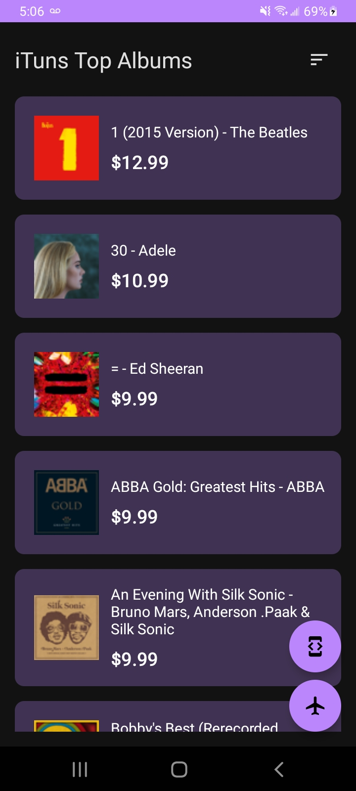
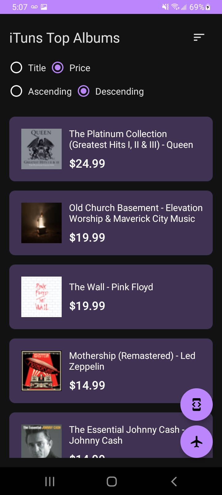
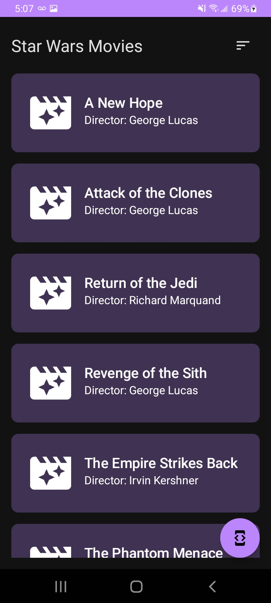
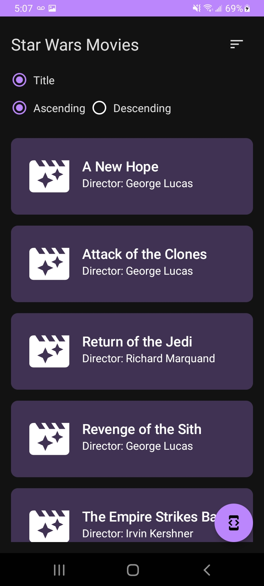

# Application made with Clean Architecture, MVVM pattern, Jetpack Compose consuming REST and GraphQL APIs

## Documentation and usage
Before you begin, please review the following prerequisites and documentation: https://itunes.apple.com/us/rss/topalbums/limit=100/json and https://studio.apollographql.com/public/star-wars-swapi/explorer?variant=current

## App Instalation
To install the app download the assignment.apk file.
* Note: You must run the app with a internet connection available. The project does not handle exceptions due to timing.

## Testing
In the class FilmListViewModelTest you can find a unit tests using Google Truth, testing the initial states of ViewModel that manage the films of the graphQL request

```kotlin
    private lateinit var viewModel: FilmListViewModel
    private var fakeFilmRepository: FakeFilmRepository = FakeFilmRepository()

    /** Setup the fake data */
    @Before
    fun setup() {
        viewModel = FilmListViewModel(FilmListUseCase(GetFilmListCase(fakeFilmRepository)))
    }

    /** FilmViewModel init states test */
    @Test
    fun testFilmInitViewModelStates() {
        Assert.assertFalse(viewModel.state.value.isOrderSectionVisible)
        Assert.assertNotNull(viewModel.state.value.filmList)
        Assert.assertEquals(OrderType.Descending, viewModel.state.value.filmOrder.orderType)
    }
}
```

## Functionality 
### Album List Screen
In the first screen we have the list of best albums from the endpoint: https://itunes.apple.com/us/rss/topalbums/limit=100/json. 
- Each list item takes you to the respective ituns page for that specific album.
- The icon at the top shows a sort panel to help find a specific album.
- The floating button with the developer tools icon takes you to the developer LinkedIn profile.
- The floating button with the airplane icon takes you to the Movie List View.





### Film List Screen
In the second screen we have the list of StarWars films from the graphQL endpoint: https://studio.apollographql.com/public/star-wars-swapi/explorer?variant=current  
- List of films charge using Apollo GraphQL.
- The icon at the top shows a sort panel to help find a specific film.
- The floating button with the developer tools icon takes you to the developer LinkedIn profile.
- The back button takes you to the first view.





## Dependencies
* Dependencies on gradle.build file. You can check the whole dependency stack and versions in Project build.gradle
```kotlin
    // Kotlin and Android dependencies
    implementation globaldependencies.ktxcore
    implementation globaldependencies.appcompat
    // Life cycle and architecture components dependencies
    implementation globaldependencies.lifecycleextensions
    implementation globaldependencies.lifecycleviewmodel
    implementation globaldependencies.fragment
    implementation globaldependencies.splashscreen
    implementation globaldependencies.coroutines
    // View and design dependencies
    implementation globaldependencies.recyclerview
    implementation globaldependencies.material
    implementation globaldependencies.constraintlayout
    implementation globaldependencies.composeui
    implementation globaldependencies.composematerial
    implementation globaldependencies.uitoolingpreview
    implementation globaldependencies.viewmodelcompose
    implementation globaldependencies.navigationcompose
    implementation globaldependencies.iconsextended
    implementation globaldependencies.hiltnavigationcompose
    implementation globaldependencies.glide
    kapt globaldependencies.glidecompiler
    //Apollo - GraphQL
    implementation globaldependencies.apollo
    //Dagger - Hilt
    implementation globaldependencies.hiltandroid
    kapt globaldependencies.hiltandroidcompiler
    implementation globaldependencies.hiltlifecycleviewmodel
    kapt globaldependencies.hiltcompiler
    // API petitions dependencies
    implementation globaldependencies.retrofit
    implementation globaldependencies.convertergson
    // Testing dependencies
    testImplementation globaldependencies.junit
    testImplementation globaldependencies.truth
    implementation globaldependencies.testcore
    testImplementation globaldependencies.archcoretestin
    testImplementation globaldependencies.coroutinestest
    // Instrumented Unit Tests
    androidTestImplementation globaldependencies.junit
    androidTestImplementation globaldependencies.truth
    androidTestImplementation globaldependencies.coroutinestest
    androidTestImplementation globaldependencies.extjunit
    androidTestImplementation globaldependencies.hilttesting
    kaptAndroidTest globaldependencies.hiltandroidcompiler
    androidTestImplementation globaldependencies.espressocontrib0'
```

## Legal
The use of the API and any related documentation is governed by and must be used in accordance with the Terms and Conditions policies, which may be found at: 
- https://developer.apple.com/documentation/applemusicapi/get_a_catalog_album.
- https://studio.apollographql.com/public/star-wars-swapi/home?variant=current
The application code usage rights belong to David Antonio Moreno.
